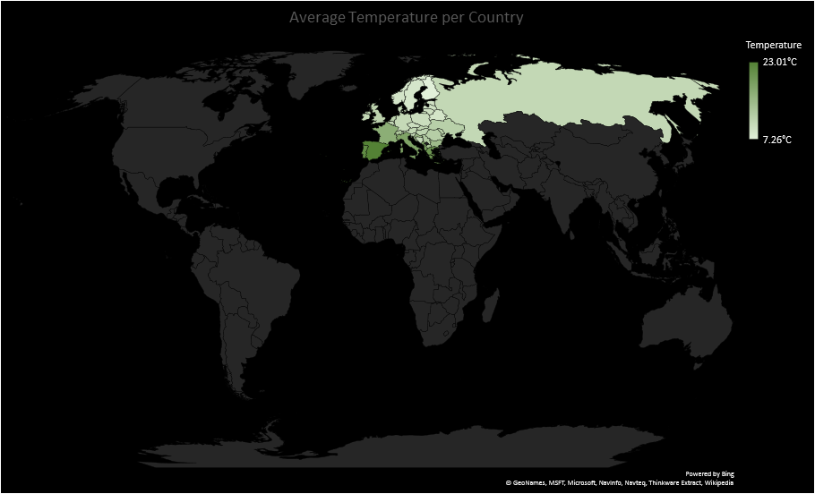
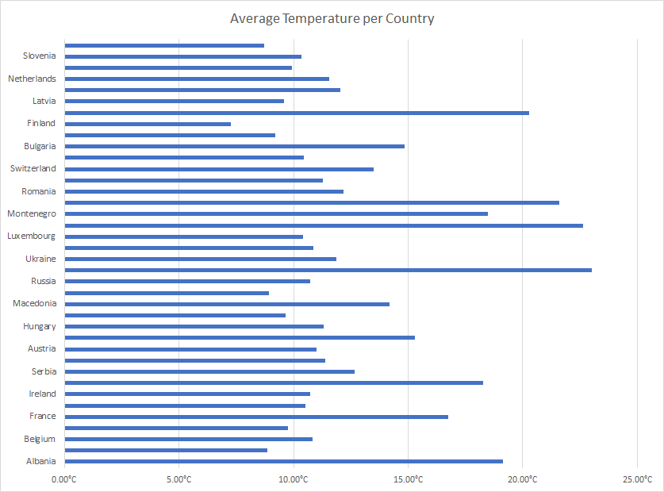

# bigdata2018
This Maven project is an adventure trip through the BigData thicket. The technology base is [Flink 1.6](https://ci.apache.org/projects/flink/flink-docs-release-1.6/), a popular framework for both, stream and batch analytics. The data was obtained from the [OpenWeatherMap-API](https://openweathermap.org/api).

At the beginning of this project, the decision was made to cover weather data from 38 european countries or 161 cities in total.
You can find the hand-crafted structure in the [europe.json](europe.json) file.

## System prerequisites
- Maven 3.5 or higher
- JDK >=1.8
- IDE like Eclipse
- **You will need an OpenWeatherMap API KEY**
- Apache Flink
## Setup
1. Clone the project with `git clone ...`
2. Create an `appids.txt` text-file (with the API KEY) in the project root directory; this is mandatory only for
   - data collection and
   - stream processing (not the simulation)
3. Build the project with `mvn clean package`
4. There are different classes with a main method for
   * collecting data - [Collector.java](src/main/java/de/hhu/rucub100/bigdata2018/source/Collector.java)
   * batch processing - [BatchJob.java](src/main/java/de/hhu/rucub100/bigdata2018/BatchJob.java)
   * stream processing - [StreamingJob.java](src/main/java/de/hhu/rucub100/bigdata2018/StreamingJob.java)
   * comparison between online and offline computed statistics - [StreamingJobCompare.java](src/main/java/de/hhu/rucub100/bigdata2018/StreamingJobCompare.java)
   * options for making predictions - [StreamingJobPrediction.java](src/main/java/de/hhu/rucub100/bigdata2018/StreamingJobPrediction.java)
5. If you use Eclipse IDE running `mvn eclipse:eclipse` might fix eclipse project structure problems with the maven project (import existing maven project)
## Overview
The structure is organized as follows:
   - source related features like data collection and the weather API are in [de.hhu.rucub100.bigdata2018.source](src/main/java/de/hhu/rucub100/bigdata2018/source)
   - all transformations are in [de.hhu.rucub100.bigdata2018.transformation](src/main/java/de/hhu/rucub100/bigdata2018/transformation)
      - the base class for batch transformations is [BatchTransformationBase.java](src/main/java/de/hhu/rucub100/bigdata2018/transformation/BatchTransformationBase.java)
      - the base class for stream transformations is [StreamTransformationBase.java](src/main/java/de/hhu/rucub100/bigdata2018/transformation/StreamTransformationBase.java)
   - utils are in [de.hhu.rucub100.bigdata2018.utils](src/main/java/de/hhu/rucub100/bigdata2018/utils)
      - [DataUtils.java](src/main/java/de/hhu/rucub100/bigdata2018/utils/DataUtils.java)
      - [GeoUtils.java](src/main/java/de/hhu/rucub100/bigdata2018/utils/GeoUtils.java)
   - sink functions are in [de.hhu.rucub100.bigdata2018.sink](src/main/java/de/hhu/rucub100/bigdata2018/sink)
### Data collection
The data collection is implemented in [Collector.java](src/main/java/de/hhu/rucub100/bigdata2018/source/Collector.java) and can be executed via [current.sh](current.sh) for the current weather, or [forecast.sh](forecast.sh) for the 5 day / 3 hour forecast.

The collected data is a txt-file with respect to the json format per line. One collector call for the current weather will add the API response for all 161 cities at once. The test-data is compressed via `gzip -k --best currentWeatherCollection.txt` to [currentWeatherCollection.txt.gz](test/currentWeatherCollection.txt.gz) with the approximate compression factor of 9. The call is executed every 15 minutes, which can be achived e.g. via a crontab as follows:
```(bash)
*/15 * * * * /bin/bash /path/to/repo/current.sh >/dev/null
```
In case of forecast, the situation is similar. The JSON serializer/deserializer used here is [gson](https://github.com/google/gson).
### Online Analysis (stream processing)
Seven different examples of stream processing were implemented:
   - [ColdestCountryPer24h](src/main/java/de/hhu/rucub100/bigdata2018/transformation/ColdestCountryPer24h.java) - The country with the lowest temperature in a window of 24 hours
   - [HottestCountryPer24h](src/main/java/de/hhu/rucub100/bigdata2018/transformation/HottestCountryPer24h.java) - The country with the highest temperature in a window of 24 hours
   - [AvgCountryTempPer24h](src/main/java/de/hhu/rucub100/bigdata2018/transformation/AvgCountryTempPer24h.java) - Average temperature per country per 24 hours
   - [ColdWind](src/main/java/de/hhu/rucub100/bigdata2018/transformation/ColdWind.java) - Detection filter for cold wind (thresholds via constructor parameters)
   - [HotAndDry](src/main/java/de/hhu/rucub100/bigdata2018/transformation/HotAndDry.java) - Detection filter for hot and dry circumstances (thresholds via constructor parameters)
   - [WeatherAlert](src/main/java/de/hhu/rucub100/bigdata2018/transformation/WeatherAlert.java) - Weather alert observing changes for temperature, wind speed, humidity and rain (via static thresholds, computation over multiple values)
   - [NeighborsDiff](src/main/java/de/hhu/rucub100/bigdata2018/transformation/NeighborsDiff.java) - Determine the neighbors (pair of countries) with the highest temperature difference per 24 hours (spatial relation)
   
The main method is located in the [StreamingJob.java](src/main/java/de/hhu/rucub100/bigdata2018/StreamingJob.java) file.
### Offline Analysis (batch processing)
Five different examples of stream processing were implemented:
   - [MaxTemperatureEurope](src/main/java/de/hhu/rucub100/bigdata2018/transformation/MaxTemperatureEurope.java) - The max temperature in Europe (country, city, temperature)
   - [MaxTemperatureDiffEurope](src/main/java/de/hhu/rucub100/bigdata2018/transformation/MaxTemperatureDiffEurope.java) - The absolute difference between the lowest and highest measured temperature in Europe
   - [ColdestCityInEurope](src/main/java/de/hhu/rucub100/bigdata2018/transformation/ColdestCityInEurope.java) - The city with the lowest measured Temperature (country, city, temperature)
   - [MinTemperatureDiffCountries](src/main/java/de/hhu/rucub100/bigdata2018/transformation/MinTemperatureDiffCountries.java) - The first five countries with the lowest temperature fluctuation
   - [AvgTemperaturePerCountry](src/main/java/de/hhu/rucub100/bigdata2018/transformation/AvgTemperaturePerCountry.java) - The average temperature of each country
   
The main method is located in the [BatchJob.java](src/main/java/de/hhu/rucub100/bigdata2018/BatchJob.java) file.
### Comparison
For comparison of stream processing events with the calculated offline values, only the following three pair constellations are suitable, which we can take from the previous examples:
   - AvgTemperaturePerCountry and AvgCountryTempPer24h;
   - MaxTemperatureEurope and HottestCountryPer24h;
   - ColdestCityInEurope and ColdestCountryPer24h;

The main method is located in the [StreamingJobCompare.java](src/main/java/de/hhu/rucub100/bigdata2018/StreamingJobCompare.java) file.
From this comparison, we can draw further conclusions about the weather on the one hand, and on the other hand, this is a good preparation for the construction of a predictive model, as we will see in the next step. For the sake of simplicity, the batch computation (offline values) were executed again here. One could have saved the results before and read them from the storage in this step.
### Options for making predictions
Weather forecasting is a highly complex topic. The resources in this project are not enough for serious results, in particular, we lack sufficient data for this purpose (for example, to approach with machine learning). For that reason, the options shown here are rather to be understood as fun examples. See [StreamingJobPrediction](src/main/java/de/hhu/rucub100/bigdata2018/StreamingJobPrediction.java).
### Visualization
You can find the results here (copied from console):
   - [batch results](test/batchResults.txt)
   - [streaming results](test/streamingResults.txt)
#### Average Temperature per Country



#### Excel
See [Excel-Visualization](test/visualization.xlsx).
